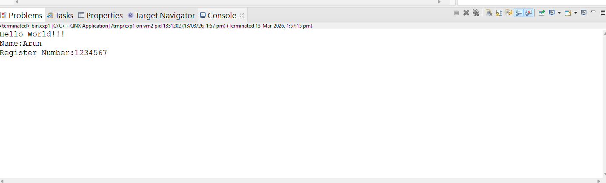

# Experiment-101 : Hello World Application on QNX: VMware Virtual Machine and Raspberry Pi

---

## Objective  
To create, build, and execute a simple “Hello World” program in QNX on two targets:  
1) QNX running inside a VMware virtual machine  
2) QNX running on Raspberry Pi hardware

---

## Hardware Requirements

### For VMware Setup
- Host PC / Laptop (Intel/AMD processor)
- Minimum 8 GB RAM recommended
- Ethernet or Wi-Fi network interface
- VMware Workstation / VMware Player
- QNX Neutrino image configured for x86_64 virtual machine

### For Raspberry Pi Setup
- Raspberry Pi board (Model 3 / 4 recommended)
- MicroSD card with QNX image flashed
- Power adapter for Raspberry Pi
- HDMI monitor and cable
- USB keyboard and mouse
- Ethernet cable or Wi-Fi connection
- Host PC running QNX Momentics IDE

---

## Software / Tools Required  

- QNX Momentics IDE (installed on host machine)
- QNX Neutrino RTOS images for:
  - VMware VM
  - Raspberry Pi
- QNX cross-compiler toolchain (`qcc`)
- Target connection through:
  - Network (preferred) **or**
  - Serial console

---

## Program (hello.c)

```c
#include <stdio.h>
#include <stdlib.h>

int main(void) {
	puts("Hello World!!!"); /* prints Hello World!!! */
	puts("NAME: THARUN P");
	puts("REG NO.: 212223060289");
	return EXIT_SUCCESS;
    printf("Hello World!!!\n");
    printf("Name:Arun\n");
    printf("Regisgter Number:1234567\n");
    return 0;
}

```
## Output



---

## Result
Thus, a simple Hello World application was successfully developed, compiled, and executed on the QNX operating system using both VMware virtual machine and Raspberry Pi hardware targets.

---


